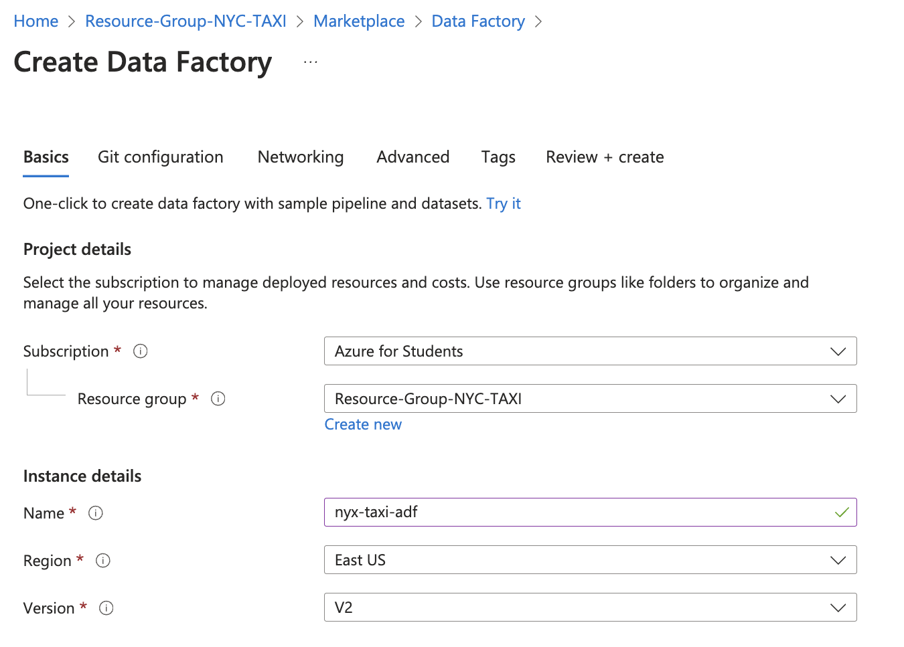

# NYC Taxi End-to-End Data Engineering Project

This project demonstrates an end-to-end pipeline for processing NYC Green Taxi data using Azure Data Factory, Azure Data Lake, and Databricks. The architecture follows the **Medallion** design with Bronze, Silver, and Gold layers.

   

---

## Project Overview

- **Source Data**: NYC Green Taxi 2023 trip records ([NYC TLC Data](https://www.nyc.gov/site/tlc/about/tlc-trip-record-data.page))
- **Objective**: Automate data ingestion, transformation, and storage across Azure services.
- **Architecture**:
    1. **Bronze Layer**: Raw data ingestion from NYC Taxi API.
    2. **Silver Layer**: Data cleaning and transformation in Databricks.
    3. **Gold Layer**: Aggregated and optimized data for analytics.
- **Tools & Technologies**:
    - **Azure Data Factory**: For orchestrating data ingestion pipelines.
    - **Azure Data Lake Storage**: For storing raw, cleaned, and transformed datasets.
    - **Databricks**: For processing and transforming data using PySpark.
    - **Delta Lake**: For optimized storage, versioning, and efficient querying in the Gold layer.
    - **PySpark**: For distributed data processing and transformation.
- **File Format**: Parquet (columnar format optimized for big data).

---

## Implementation Steps

### Phase 1: Data Ingestion (Bronze Layer)
1. **Azure Resource Group**:
   - Create a resource group in Azure to organize all resources.
   - No tags are needed for this project.
   - Fetching the data from source NYC green taxi parquet file data, using the ADF to ingest the data into the bronze or raw zone in parquet format and use datalake for that.
    
    

2. **Create Azure Data Lake**:
   - Now after creating the resource group, next need to create a very first resource which is data lake.
   - Search for **Storage Account** in Azure and while creating the storage account enable **Hierarchical Namespace** to use it as a Data Lake.
   - Settings:
     - **Performance**: Standard
     - **Redundancy**: Locally-redundant storage (LRS)
     - **Access Tier**: Hot

    
    

3. **Data Lake Containers**:
   - Once the Storage account is created the in storage account, next step is to containers -
   - Create containers for `bronze`, `silver`, and `gold` layers.
   - Upload reference files:
     - create the 2 different directory and upload trip_type and trip_zone, then upload the trip_type.csv in trip_type & taxi_zone_lookup.csv file in trip_zone directory (the csv is in  data directory in this repo for reference or can be downloaded from NYC official site)
     - `trip_type.csv` → `bronze/trip_type`
     - `taxi_zone_lookup.csv` → `bronze/trip_zone`

    

4. **Azure Data Factory (ADF)**:
   - As ingestion pipeline of the data is built in ADF, so now create a ADF resource, so select the resource group  and enter the unique name under the Instance details —> Name and then directly click on review+create and create.
    
    

   - Once the Data Factory is created then launch the studio and using the manage tabs create the Linked Services.
   - Linked Services is bridge between the data factory and external data sources, enabling seamless data integration and movement. Source—>>ADF—>>>Destination/Sink.
   - For this project the data is fetched directly from NYC website through an API and dump it in bronze container.
   - Configure **Linked Services**:
     - **HTTP Linked Service**:
       - Base URL: `https://d37ci6vzurychx.cloudfront.net`
       - As it is opensource data select the Authentication: Anonymous
       - Test the connection.

    

     - **ADLS Linked Service**:
       - Create a ADLGen2 linked service, Enter the Name and select the subscription of you account trail/paid then sell the storage account name and then test the connection
       -  And link to the previously created Data Lake.

    

5. **ADF Pipeline for Data Ingestion**:
   - Now navigate to factory resources tab in DF and create a new pipeline then enter the name.
   - From activity tab drag the **Copy Data** activity and name it.
   - Now configure parameters to automate fetching files for each month dynamically:
     - click on source tab inside the copy data activity, source will help to get the particular file/dataset from the connection/linkedservice, click the + New it will help to create the new dataset, then type HTTP  —>> continue, select file type as Parquet.
          
    - Source: HTTP Parquet files 
    

     - Now it’s time to create a sink dataset. So, for sink select ADLSGen2 and followed with the filetype parquet.

     - Sink: ADLS Parquet files in the `bronze` container.
    

  - Now till the above step the only one file or only one month file is got dumped or populated in our bronze / raw data container, so now will implement for all the months. 
   - Add **ForEach Activity** to iterate through all months (1 to 12).
  - So drag the If condition activity and ForEach Activity from activity tab and paste the copy data activity in false activity  and write the expression -> @greater(item(),9)
    in if condition. 

    
  
  - To iterate through all the months files, need to pass the parameter to run the pipeline as a dynamic. 
  - Again navigate to copy data source tab and select the open which is next to source dataset dropdown ->>pen/pencil symbol and then go to parameter tab for parametrized dataset.

    
    
   
   - As the now then select the connection tab and click the URL which will enable a option to  Add dynamic content -
   ```sql
   trip-data/green_tripdata_2023-0@{dataset().p_month}.parquet
   ```
   - so here  dataset().p_month is a variable which is passed in the parameter.
     
     

   - Now to iterate for all 12 month we need a ForEach activity so drag the ForEach activity from Activities. 
   - In settings tab select check box the **sequential** to get the data load sequentially & in items add the dynamic connect and under function tab select range() function to define the **range(1,12)**. i.e i will run the loop from  1 till 12.  

     

   - And then cut the copy data activity and paste in ForEach loop activities.

     

   - Now navigate to copy data activity underForEach  and click the Add the dynamic content in Dataset properties value textbox write the **@item()** and thus it will get the iterated value and load all the files.
     
     

   - Run the pipeline in debug mode and publish all.
     
     

---

### Phase 2: Raw to Silver Data Transformation (Silver Layer)
## Setting Up Data Access with Databricks and Service Principal

In this phase, raw data from the Bronze layer is read, transformed, and saved into the Silver and Gold layers using Databricks and PySpark.

To enable Databricks to read and write data to Azure Data Lake, a **Service Principal** is created and configured. This allows secure access to the Data Lake with the necessary permissions.

---

### Key Steps

#### 1. Why Use a Service Principal?
- A **Service Principal** acts as an application identity that allows Databricks to securely read from and write to Azure Data Lake.
- It ensures proper access control and avoids hardcoding sensitive credentials directly into scripts.

---

#### 2. Creating a Service Principal
Follow these steps to create a Service Principal in Azure:

1. **Navigate to Microsoft Entra ID**:
   - Open the Azure Portal.
   - Go to **Microsoft Entra ID** > **App Registrations**.

2. **Register a New Application**:
   - Click on **New Registration**.
   - Enter a name for the application (e.g., `DatabricksServicePrincipal`).
   - Complete the registration process.

3. **Validate the Application**:
   - Once created, validate the application details.

---

#### 3. Assign Roles to the Service Principal
The Service Principal needs specific permissions to access Azure Data Lake. Follow these steps:

1. **Navigate to the Storage Account**:
   - Go to the storage account linked to your Data Lake.

2. **Assign the Necessary Role**:
   - Go to **Access Control (IAM)**.
   - Add a **Role Assignment** with the following details:
     - **Role**: `Storage Blob Data Contributor`
     - **Member**: Select the Service Principal created in the previous step.
   - This role allows the Service Principal to read, write, and delete data in the Azure Storage Blob containers.

    
---

### Key Role of the Service Principal in the Project
- Enables Databricks to:
  - Read raw data from the Bronze layer.
  - Apply transformations and create structured data for the Silver layer.
  - Generate analytical data for the Gold layer.
- Ensures secure and efficient access to Azure Data Lake.

---

### Next Steps
Once the Service Principal is set up and configured, use its credentials in Databricks to connect to the Data Lake. This setup is essential for performing data transformations and analytics in subsequent phases.

  **Databricks workspace and cluster setup**
  
   

   

#### 4. Connect Databricks to Data Lake:
   - Use the following PySpark configuration in Databricks notebooks:
     ```python
     spark.conf.set("fs.azure.account.auth.type.<storage-account>.dfs.core.windows.net", "OAuth")
     spark.conf.set("fs.azure.account.oauth.provider.type.<storage-account>.dfs.core.windows.net", 
                    "org.apache.hadoop.fs.azurebfs.oauth2.ClientCredsTokenProvider")
     spark.conf.set("fs.azure.account.oauth2.client.id.<storage-account>.dfs.core.windows.net", "<application-id>")
     spark.conf.set("fs.azure.account.oauth2.client.secret.<storage-account>.dfs.core.windows.net", service_credential)
     spark.conf.set("fs.azure.account.oauth2.client.endpoint.<storage-account>.dfs.core.windows.net", 
                    "https://login.microsoftonline.com/<directory-id>/oauth2/token")
     ```
   - Replace placeholders with:
     - `<storage-account>`: Storage account name
     - `<application-id>`: Client ID
     - `<directory-id>`: Tenant ID
     - `service_credential`: Secret value.

    **Transform Data in Silver Layer**:

    The Raw_to_Silver_Notebook file processes raw data from the Bronze layer by:
    - Cleaning and transforming datasets using PySpark.
    - Renaming columns, fixing missing and invalid values, and deriving new fields (e.g., trip duration).
    - Dropping unnecessary columns and standardizing data formats.
    - Saving the cleaned and structured data into the Silver layer in Parquet format for further analysis.

---

### Phase 3: Data Aggregation (Gold Layer)

1. **Silver-to-Gold Transformations**:
    - Aggregating and optimizing datasets for analytics using PySpark and Delta Lake.
    - Performing advanced transformations and creating derived metrics (e.g., average revenue, trip duration).
    - Writing the processed data to the Gold layer in Delta format for improved performance.
    - Generating analytical views to support business intelligence and reporting needs.

2. **Data Outputs**:
   - Store the final data in the `gold` container for easy access by BI tools.
   - Enable efficient storage and querying of large datasets through optimized Delta format.
   - Support advanced features like data versioning, schema enforcement, and fast updates for analytical workflows.

---

## Key Features of the overall project

1. **Dynamic Data Ingestion**:
   - Automates the downloading of monthly data using ADF pipelines.
2. **Transformations with PySpark**:
   - Handles data cleaning and standardization in the Silver layer.
3. **Optimized Storage**:
   - Parquet format ensures efficient storage and query performance.
4. **Scalable Architecture**:
   - Medallion architecture supports future scalability.

---

### Future Enhancements
- Automating pipeline deployments using Infrastructure as Code (e.g., Terraform).
- Adding real-time data ingestion using Azure Event Hubs.
- Incorporating additional datasets for enriched analytics.

--- 