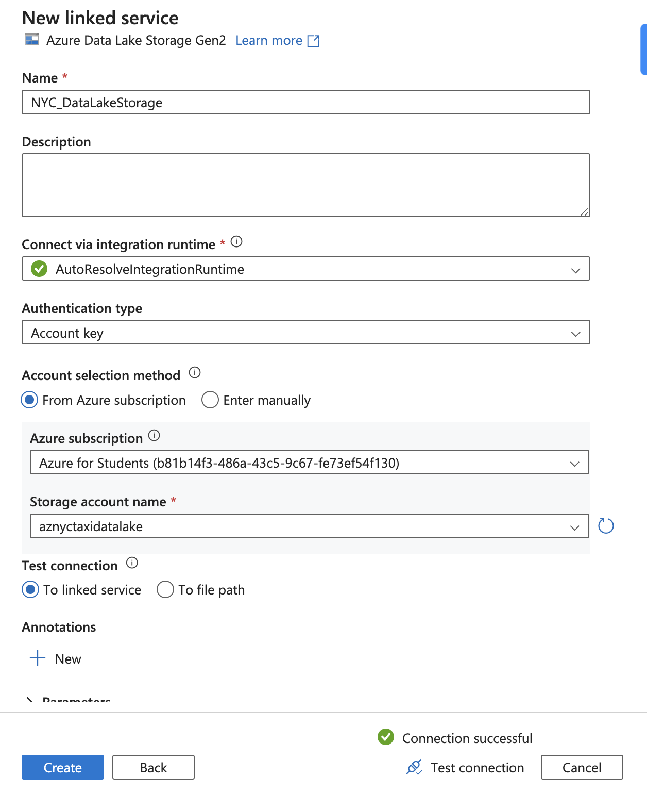

# NYC Taxi End-to-End Data Engineering Project

This project demonstrates an end-to-end pipeline for processing NYC Green Taxi data using Azure Data Factory, Azure Data Lake, and Databricks. The architecture follows the **Medallion** design with Bronze, Silver, and Gold layers.

---

## Project Overview

- **Source Data**: NYC Green Taxi 2023 trip records ([NYC TLC Data](https://www.nyc.gov/site/tlc/about/tlc-trip-record-data.page))
- **Objective**: Automate data ingestion, transformation, and storage across Azure services.
- **Architecture**:
  - **Bronze Layer**: Raw data ingestion.
  - **Silver Layer**: Transformed and cleaned data.
  - **Gold Layer**: Aggregated and optimized data for analytics.
- **Tools & Technologies**:
  - Azure Data Factory
  - Azure Data Lake Storage (ADLS)
  - Databricks with PySpark
- **File Format**: Parquet (columnar format optimized for big data).

---

## Implementation Steps

### Phase 1: Data Ingestion (Bronze Layer)
1. **Azure Resource Group**:
   - Create a resource group in Azure to organize all resources.
   - No tags are needed for this project.
   - Fetching the data from source NYC green taxi parquet file data, using the ADF to ingest the data into the bronze or raw zone in parquet format and use datalake for that.
    
    

2. **Create Azure Data Lake**:
   - Now after creating the resource group, next need to create a very first resource which is data lake.
   - Search for **Storage Account** in Azure and while creating the storage account enable **Hierarchical Namespace** to use it as a Data Lake.
   - Settings:
     - **Performance**: Standard
     - **Redundancy**: Locally-redundant storage (LRS)
     - **Access Tier**: Hot

    
    

3. **Data Lake Containers**:
   - Once the Storage account is created the in storage account, next step is to containers -
   - Create containers for `bronze`, `silver`, and `gold` layers.
   - Upload reference files:
     - create the 2 different directory and upload trip_type and trip_zone, then upload the trip_type.csv in trip_type & taxi_zone_lookup.csv file in trip_zone directory (the csv is in  data directory in this repo for reference or can be downloaded from NYC official site)
     - `trip_type.csv` → `bronze/trip_type`
     - `taxi_zone_lookup.csv` → `bronze/trip_zone`

    

4. **Azure Data Factory (ADF)**:
   - As ingestion pipeline of the data is built in ADF, so now create a ADF resource, so select the resource group  and enter the unique name under the Instance details —> Name and then directly click on review+create and create.
    
    

   - Once the Data Factory is created then launch the studio and using the manage tabs create the Linked Services.
   - Linked Services is bridge between the data factory and external data sources, enabling seamless data integration and movement. Source—>>ADF—>>>Destination/Sink.
   - For this project the data is fetched directly from NYC website through an API and dump it in bronze container.
   - Configure **Linked Services**:
     - **HTTP Linked Service**:
       - Base URL: `https://d37ci6vzurychx.cloudfront.net`
       - As it is opensource data select the Authentication: Anonymous
       - Test the connection.

    

     - **ADLS Linked Service**:
       - Create a ADLGen2 linked service, Enter the Name and select the subscription of you account trail/paid then sell the storage account name and then test the connection
       -  And link to the previously created Data Lake.

    

